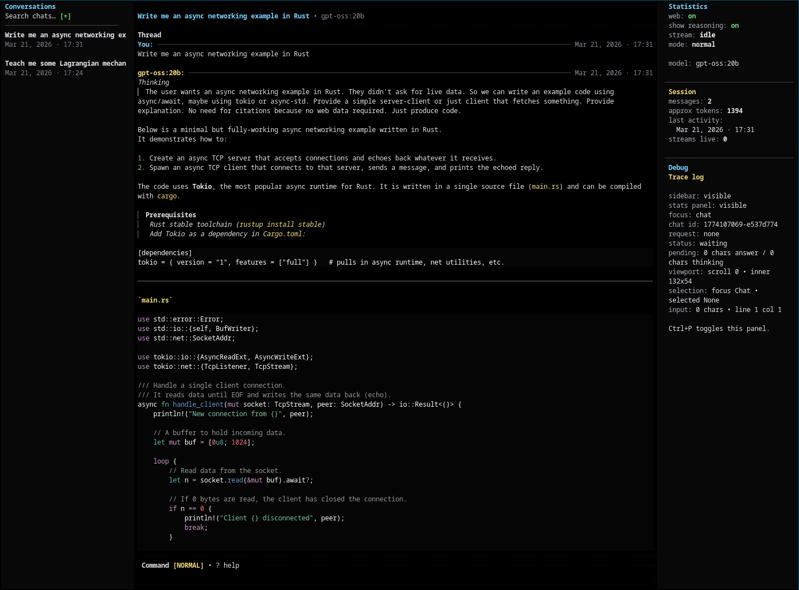
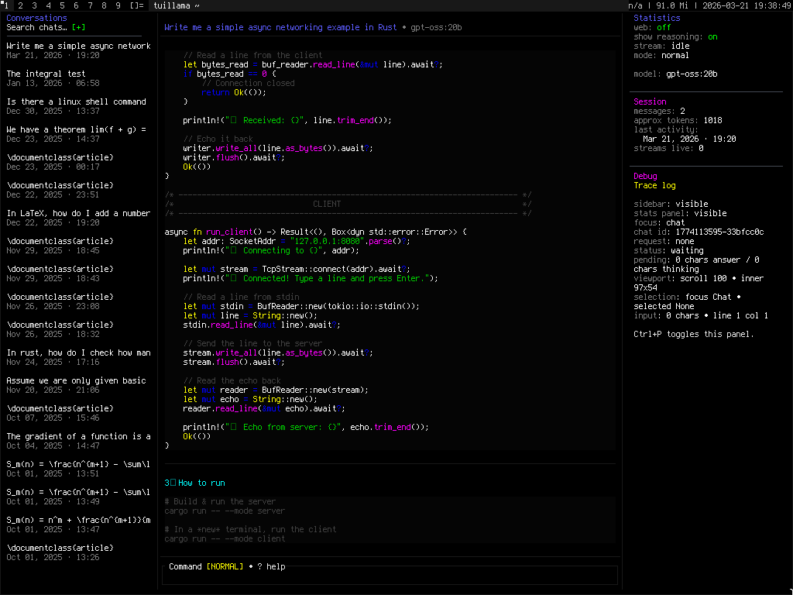
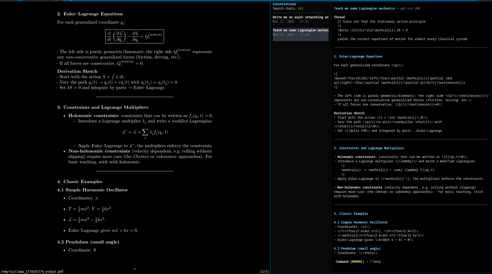

# tuillama

Finally, a minimalist yet competent Ollama interface. 

## Features 

* Really fast and minimal
* Vim keys
* Beautiful markdown formatting and syntax highlighting on the terminal
* Dynamic compilation of messages to PDF or HTML (with LaTeX support!)
* Toggleable agentic web search mode (`Ctrl+W`) for Ollama-compatible providers

## Preview





## No LaTeX on the terminal? No problem

Preview mode renders Markdown + LaTeX to HTML with MathJax. Enter visual mode, select a message, and press `Enter`.




## Architecture

`tuillama` now uses a client/server split with separate executables:

* **Client (`tuillama`):** handles rendering, input, navigation, and stream presentation.
* **Server (`tuillama-server`):** owns all Ollama HTTP streaming, emits structured events, and tags every stream with `chat_id` + `request_id`.

This prevents streamed tokens from spilling into a different chat when switching views and supports multiple chats generating concurrently.

## Requirements

* Rust toolchain
* Ollama
* `pandoc` and a default browser (`xdg-open` on Linux) for previewing messages
* `xclip` for clipboard integration
* `lualatex` and the LaTeX toolkit for previewing messages (I will eventually make the LaTeX engine configurable)

Optional

* A font with good Unicode/emoji support

## Build and run

```bash
cargo build --release

# pull or start a model
ollama pull llama3
# or: ollama run llama3

# run server (separate terminal)
cargo run --bin tuillama-server

# run client
cargo run --bin tuillama
```

Environment overrides (take precedence over config):

```bash
export OLLAMA_MODEL=llama3
export OLLAMA_CHAT_URL=http://localhost:11434/api/chat
export TUILLAMA_SERVER_ADDR=127.0.0.1:7878
export OLLAMA_API_KEY=<optional_api_key>
```

## Configuration

Config file path (XDG):

* `${XDG_CONFIG_HOME:-$HOME/.config}/tuillama/config.toml`

Precedence: environment variables > config file > built-ins.

All keys under `[options]` are forwarded to Ollama's `options` field.

You can set `ollama_api_key` in config (or `OLLAMA_API_KEY` in env) for hosted providers that require bearer auth.

Press `Ctrl+W` in the client UI to toggle server-side agentic web search per request. In this mode the server loops over `web_search`/`web_fetch` tool calls and returns the final answer to the client.

You can also set the server endpoint in config with `server_addr = "127.0.0.1:7878"`.

## Limitations (for now)

* Models and custom options require manually editing the config file and restarting the app
* The UI is still minimal and rough around the edges
* No image support (this should be relatively easy to fix)
* A bunch of other stuff, probably, since the app is so minimal
