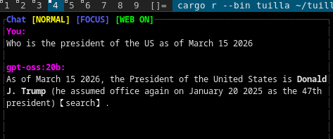

# tuillama

Finally, a minimalist yet competent Ollama interface. 

## Features 

* Really fast and minimal
* Vim keys
* Beautiful markdown formatting and syntax highlighting on the terminal
* Dynamic compilation of messages to PDF or HTML (with LaTeX support!)
* Built-in web and local file tools, with `Ctrl+W` to force a web retrieval preflight

## Preview


## Agentic web search

Press Ctrl-W to force an agentic web retrieval preflight for the next request. The model can still choose `web_search` or `web_fetch` on its own whenever tools are useful; hosted providers may require an Ollama API key in the configuration file.




## Built-in tools

`tuillama-server` gives the model the available tools on every request.: if you ask the assistant to search the web, read a file, list a directory, or search files, the model can call the appropriate tool directly.

Available tools:

| Tool | What it does |
| --- | --- |
| `web_search(query)` | Search the web for up-to-date information. |
| `web_fetch(url)` | Fetch and parse a specific web page. |
| `file_list(path, glob)` | List a local directory, optionally filtered with a glob. |
| `file_read(path, start_line, end_line)` | Read a local file with line numbers for citations. |
| `file_search(query, path, glob)` | Search local files and return path + line-number matches. |

The file tools are read-only. They support normal paths plus `~/...` expansion, and large files over the server's built-in byte limit are skipped or rejected.

### Asking the model to use local files

You can ask natural-language questions that map to the file tools:

* **List a directory** with `file_list(path, glob)`:
  * “List the files in `src/modules`.”
  * “Show Rust files under `src` matching `**/*.rs`.”
* **Read line-cited file contents** with `file_read(path, start_line, end_line)`:
  * “Read `src/main.rs` lines 1 through 80 and explain the startup flow.”
  * “Open `README.md` around the configuration section.”
* **Search files** with `file_search(query, path, glob)`:
  * “Search for `ToolCallStarted` in `**/*.rs`.”
  * “Find references to `web_search` under `src/bin`.”
  * “Find TODOs under the current directory.”

Tool results include paths and line numbers so the assistant can cite exactly where file content came from.

### Tool-call trace events

The server emits structured lifecycle events for every tool call:

* `tool_call_started` with request/chat/tool IDs, tool name, and arguments
* `tool_call_finished` with a short result summary
* `tool_call_failed` with the error message

The client currently surfaces these as status updates, and the protocol is ready for a richer auditable trace UI.

### Attachment storage

New attachments are stored outside chat JSON under:

```text
${XDG_DATA_HOME:-$HOME/.local/share}/tuillama/attachments/<sha256>
```

Chat files keep only metadata such as the original path, MIME type, SHA-256, size, and store path. Before a request is sent to `tuillama-server`, the client loads image bytes from its local attachment store and includes them as base64 data in the request, so the server does not need access to the client filesystem path. Non-image attachments are stored as metadata for now.

## No LaTeX on the terminal? No problem

Preview mode renders Markdown + LaTeX to HTML with MathJax. Enter visual mode, select a message, and press `Enter`. In visual mode, press `y` to copy the selected message, `c` to cycle through code blocks in that message, and `y` again to copy only the highlighted code block.


## Architecture

`tuillama` now uses a client/server split with separate executables:

* **Client (`tuillama`):** handles rendering, input, navigation, and stream presentation.
* **Server (`tuillama-server`):** owns all Ollama HTTP streaming, emits structured events, and tags every stream with `chat_id` + `request_id`.

This prevents streamed tokens from spilling into a different chat when switching views and supports multiple chats generating concurrently.

## Requirements

* Rust toolchain
* Ollama
* `pandoc` and a default browser (`xdg-open` on Linux) for previewing messages
* `xclip` for clipboard integration
* `lualatex` and the LaTeX toolkit for previewing messages (I will eventually make the LaTeX engine configurable)

Optional

* A font with good Unicode/emoji support

## Build and run

```bash
cargo build --release

# pull or start a model
ollama pull llama3
# or: ollama run llama3

# run server (separate terminal)
cargo run --bin tuillama-server

# run client
cargo run --bin tuillama
```

Environment overrides (take precedence over config):

```bash
export OLLAMA_MODEL=llama3
export OLLAMA_CHAT_URL=http://localhost:11434/api/chat
export TUILLAMA_SERVER_ADDR=127.0.0.1:7878
export OLLAMA_API_KEY=<optional_api_key>
# optional: enable server debug traces for tool use
export TUILLAMA_DEBUG_WEB=1
```

## Configuration

Config file path (XDG):

* `${XDG_CONFIG_HOME:-$HOME/.config}/tuillama/config.toml`

Precedence: environment variables > config file > built-ins.

All keys under `[options]` are forwarded to Ollama's `options` field.

You can set `ollama_api_key` in config (or `OLLAMA_API_KEY` in env) for hosted providers that require bearer auth.

The server gives every request the full built-in tool set (`web_search`, `web_fetch`, `file_list`, `file_read`, and `file_search`) and loops over model-requested tool calls before streaming the final answer. Press `Ctrl+W` in the client UI when you want to force an initial web retrieval before model reasoning.
If your prompt includes one or more full `http://` or `https://` URLs while Ctrl-W web preflight is enabled, the server fetches those exact pages first (instead of searching) so you can ask for targeted extraction/summarization of a specific source.
When debugging tool use, run the server with `TUILLAMA_DEBUG_WEB=1` to print per-request traces (tool calls, endpoints, statuses, extracted URLs) to stderr.

You can also set the server endpoint in config with `server_addr = "127.0.0.1:7878"`.
Set `render_emojis = false` in config to suppress emoji graphemes in rendered Markdown when your terminal/font does not handle them well.

Command mode opens from normal mode with `:` and executes commands with Enter. Supported commands include `:attach /path/to/image` to queue an image attachment for the next message, `:web on` to enable web search, and `:set <option> <value>` to change config-backed settings for the current session without writing the config file. For example, use `:set model qwen3.6:27b`, `:set api_url http://localhost:11434/api/chat`, `:set num_ctx 32768`, `:set temperature 0.7`, `:set syntax.enabled false`, `:set colors.stats_accent green`, or `:set preview.preview_fmt pdf`. Bare unknown `:set` keys are treated as Ollama `[options]` entries, so `:set num_ctx 32768` and `:set options.num_ctx 32768` are equivalent.

## Limitations (for now)

* The UI is still minimal and rough around the edges
* Attachment support is still evolving; non-image attachments are stored as metadata but are not yet injected into model context automatically.
* A bunch of other stuff, probably, since the app is so minimal
