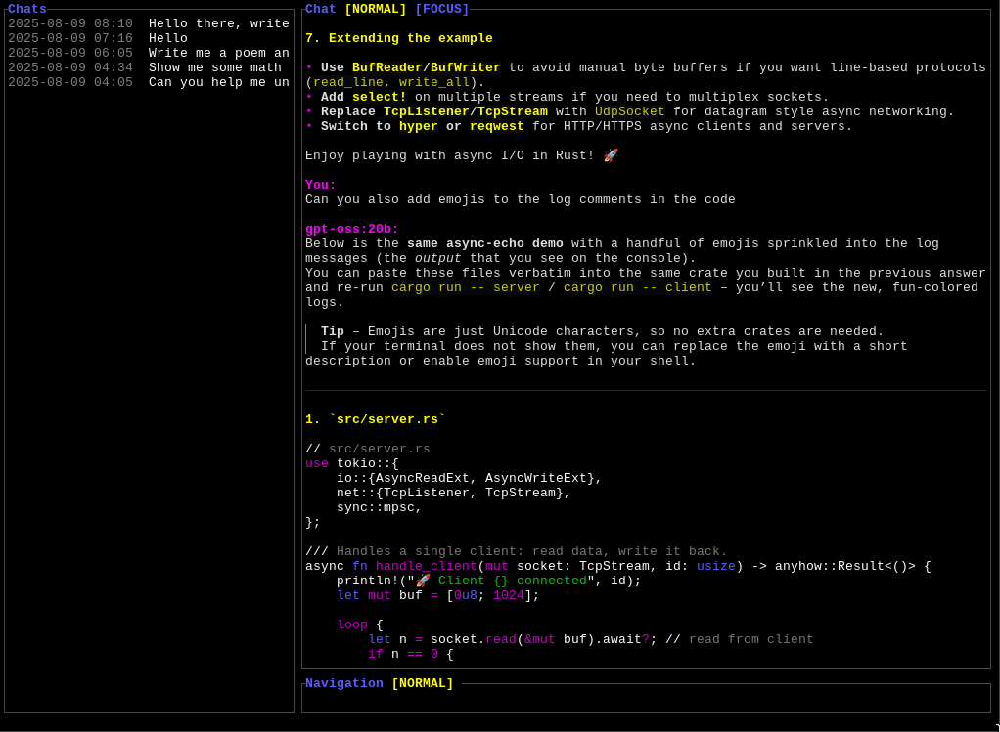
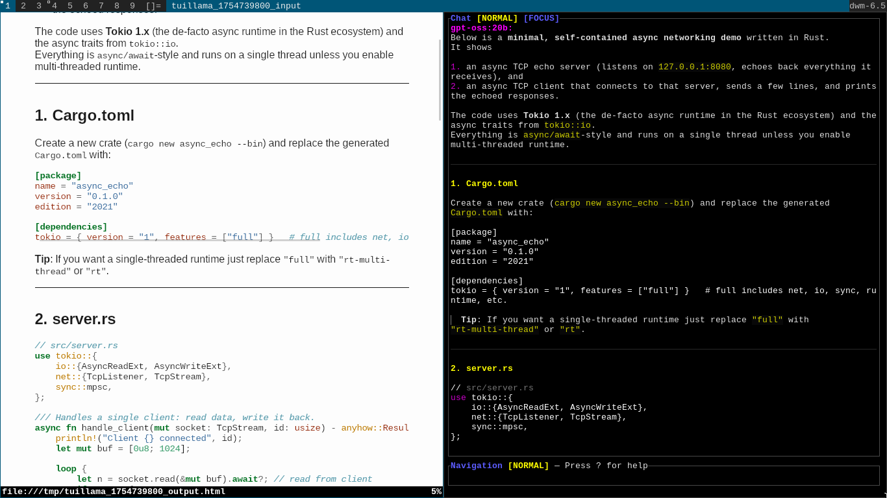
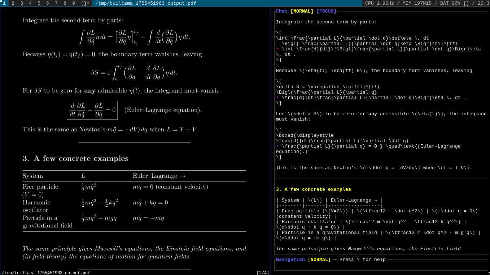

# tuillama

Finally, a minimalist yet competent Ollama interface. 

## Features 

* Really fast and minimal
* Vim keys
* Beautiful markdown formatting and syntax highlighting on the terminal
* Dynamic compilation of messages to PDF or HTML (with LaTeX support!)

## Preview





## No LaTeX on the terminal? No problem

Preview mode renders Markdown + LaTeX to HTML with MathJax. Enter visual mode, select a message, and press `Enter`.




## Requirements

* Rust toolchain
* Ollama
* `pandoc` and a default browser (`xdg-open` on Linux) for previewing messages
* `xclip` for clipboard integration
* `lualatex` and the LaTeX toolkit for previewing messages (I will eventually make the LaTeX engine configurable)

Optional

* A font with good Unicode/emoji support

## Build and run

```bash
cargo build --release

# pull or start a model
ollama pull llama3
# or: ollama run llama3

# run the app
cargo run
```

Environment overrides (take precedence over config):

```bash
export OLLAMA_MODEL=llama3
export OLLAMA_CHAT_URL=http://localhost:11434/api/chat
```

## Configuration

Config file path (XDG):

* `${XDG_CONFIG_HOME:-$HOME/.config}/tuillama/config.toml`

Precedence: environment variables > config file > built-ins.

All keys under `[options]` are forwarded to Ollama's `options` field.

## Limitations (for now)

* Models and custom options require manually editing the config file and restarting the app
* The UI is clumsy at times + you must have the proper chat open at all times whilst the LLM is typing
* No image support (this should be relatively easy to fix)
* A bunch of other stuff, probably, since the app is so minimal
